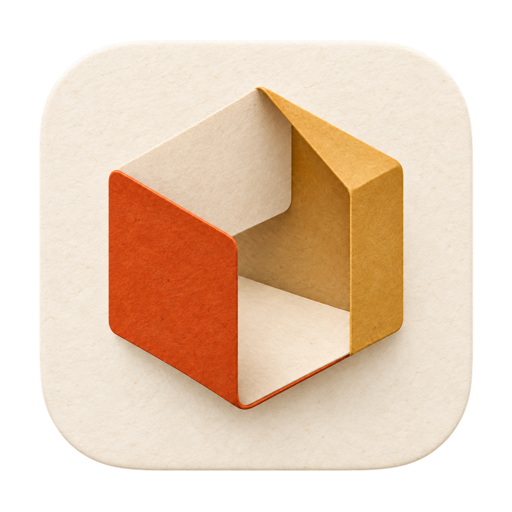

<p align="center"></p>

# 造物台 · Zaowutai

一个中文 AI 桌面工作台，把对话、项目文件、助手与模型对比放在一起。

由 [@17lijunyi](https://github.com/17lijunyi) 维护，基于 [产品经理工作台](https://github.com/Zhouchengjian-user/product-manager-workbench) 二次开发；底层来自 [AionUi](https://github.com/iOfficeAI/AionUi) 与 [AionCore](https://github.com/iOfficeAI/AionCore)。

## 能做什么

- **围绕项目协作**：选择本地文件夹，与配置好的 AI 助手讨论需求、文档和代码。
- **接入不同助手**：统一使用 Codex CLI、Claude Code、Pi 等入口；需自行安装、登录或配置对应服务。
- **选择模型与思考强度**：中文档位菜单；Pi 更换 API 配置后，可在模型菜单点击“刷新模型列表”。
- **对比模型**：同一份提示词与材料，对比多个模型的结果，支持停止、重试与保存。
- **管理工作**：会话、助手、团队、项目和定时任务入口。

## 本分支的改动

造物台采用米白纸纹与橙金折纸风格，提供独立的应用名称和图标。本分支还改进了工具调用及授权界面的中文展示、首页档位记忆、Pi 模型加载和刷新，并修复了部分会话显示与本地打包问题。

详见 [造物台修改记录](docs/ZAOWUTAI.md)。原项目改造记录保留在 [docs/MODIFICATIONS.md](docs/MODIFICATIONS.md)。

## 本地开发

当前主要验证环境为 Apple Silicon Mac。Windows、Linux 的构建配置来自上游，本分支尚未逐个平台验收。

准备 Node.js 22–24、Bun、Rust stable 和所在平台的原生构建工具；Mac 需要 Xcode Command Line Tools。保留 `AionUi` 与 `AionCore` 的同级目录关系。

```bash
git clone https://github.com/17lijunyi/zaowutai.git
cd zaowutai/AionUi
bun install
node scripts/prepareAioncore.js
bun run start
```

`prepareAioncore.js` 按本分支配置从相邻的 `AionCore` 源码构建后端。首次安装与构建需要下载依赖，耗时取决于网络及机器性能。

构建 Apple Silicon Mac 应用：

```bash
bun run build-mac:arm64
```

构建产物位于 `AionUi/out/`。源码仓库不附带 API 服务或个人账号配置；安装后需自行配置助手和模型服务。

更多资料：[桌面端说明](AionUi/readme.md) · [后端架构](AionCore/ARCHITECTURE.zh-CN.md) · [模型对比台](AionUi/docs/guides/model-bench.zh-CN.md)

## 反馈与贡献

欢迎在 [Issues](https://github.com/17lijunyi/zaowutai/issues) 提交问题。请附上系统、助手类型、复现步骤和脱敏截图，不要附带 API 密钥或私人对话。

前端贡献遵循 [AionUi/AGENTS.md](AionUi/AGENTS.md) 与 [贡献指南](AionUi/CONTRIBUTING.md)，后端遵循 [AionCore/AGENTS.md](AionCore/AGENTS.md)。

## 开源与致谢

本分支的代码新增与修改沿用 **Apache-2.0** 许可。原项目及第三方代码、素材的许可证与版权声明继续有效，详见 [LICENSE](LICENSE)、[NOTICE](NOTICE) 和 [作者说明](docs/AUTHORS.md)。

感谢周承健、AionUi、AionCore 及所有上游贡献者。本项目是独立维护的衍生版本，不代表上游官方发行或背书。
