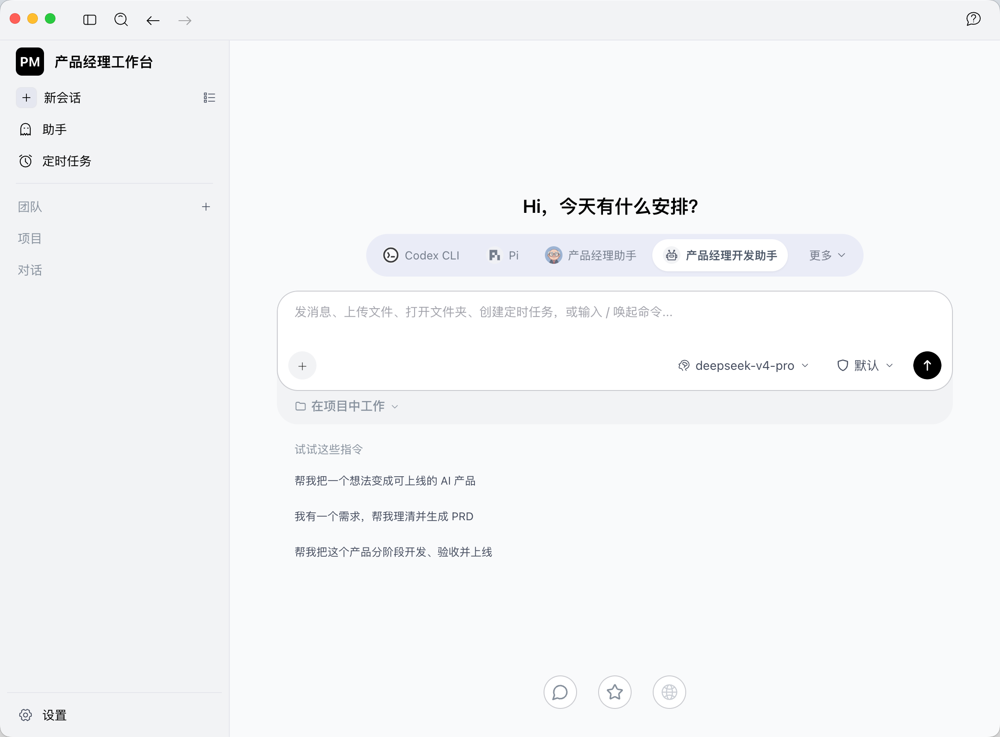

# 产品经理工作台

**把想法、需求、项目和 AI 协作放在一个桌面工作台里。**

产品设计与定制开发：**周承健** · [GitHub @Zhouchengjian-user](https://github.com/Zhouchengjian-user)



> 实际产品界面，由作者提供。图中助手、模型和服务配置取决于本机设置；个人账号、密钥与会话数据不随源码提供。

## 为产品经理的日常工作而做

从一个想法开始，借助 AI 梳理需求、组织 PRD、围绕项目资料协作，再推进开发与验收。产品经理工作台将这些工作入口集中到桌面应用中，方便在对话、助手和项目之间切换。

- **需求梳理**：围绕产品想法、需求材料和文档，与所配置的 AI 助手协作。
- **项目协作**：将本地项目文件夹加入对话，让工作围绕实际项目展开。
- **模型对比**：用同一份提示词与材料，对比 2～4 个模型的回答，支持独立流式输出、停止、重试与保存记录。
- **统一工作入口**：在桌面端使用会话、助手、团队、项目与定时任务等能力。

AI 服务需要自行配置；实际输出质量与可用能力取决于所选模型、接口和助手。模型对比台的支持范围见[使用说明](AionUi/docs/guides/model-bench.zh-CN.md)。

## 我的定制与改造

本产品由周承健基于 AionUi / AionCore 定制开发。上游提供基础架构与通用能力，本分支的工作重点包括：

| 方向 | 本分支改造 |
| --- | --- |
| 产品品牌 | “产品经理工作台”名称、PM 标识、应用图标与窗口品牌展示 |
| 中文使用体验 | 中文启动语言及产品文案的定制 |
| 项目文件夹 | 文件夹选择、项目附加入口与对话中的文件夹展示 |
| 模型对比台 | 对比页面、服务端接口、结果保存与相关测试 |
| 定制版本维护 | 本地后端打包适配及避免定制版被上游更新替换的处理 |

详细文件范围和上游基线见[修改记录](docs/MODIFICATIONS.md)。会话、通用助手、团队、定时任务等基础能力来自上游，本仓库不将这些能力声明为独立原创。

## 项目结构

```text
product-manager-workbench/
├── AionUi/       # Electron 桌面端与前端
├── AionCore/     # Rust 后端与接口
├── docs/         # 产品截图、作者与修改记录
├── LICENSE      # Apache 2.0 许可证副本
└── NOTICE       # 上游归属与本分支版权说明
```

## 开发与使用

请保留 `AionUi` 与 `AionCore` 的同级目录关系，并按原项目文档准备环境、安装依赖与构建：

- [桌面端文档](AionUi/readme.md) · [前端脚本](AionUi/package.json)
- [后端架构](AionCore/ARCHITECTURE.zh-CN.md) · [后端任务](AionCore/justfile)
- [模型对比台使用说明](AionUi/docs/guides/model-bench.zh-CN.md)

当前仓库提供源码；不包含安装后的依赖、编译缓存、个人助手配置、密钥或聊天记录。截图中的个人配置需自行设置。功能代码沿用已上传的工作区快照，此次品牌文档更新不代表完成了新的构建或功能验收。

## 作者与反馈

**周承健** — 产品设计、本分支定制开发与维护。

欢迎通过 [GitHub Issues](https://github.com/Zhouchengjian-user/product-manager-workbench/issues) 提交问题和建议；请勿在反馈中附带密钥、账号凭据或私人会话内容。更多归属说明见[作者与品牌](docs/AUTHORS.md)。

## 开源来源与版权

基于 [AionUi](https://github.com/iOfficeAI/AionUi) 与 [AionCore](https://github.com/iOfficeAI/AionCore) 开发，感谢上游作者和贡献者。

**Copyright 2026 周承健 — 本分支中由周承健享有权利的原创新增内容及修改部分。** 上游代码与素材的版权仍归原权利人所有，原有声明完整保留。

本分支自有代码新增与修改部分采用 Apache-2.0 许可；相关使用、修改和分发须遵守许可证。产品署名不构成上游官方背书，也不授予任何第三方商标权。详见 [LICENSE](LICENSE)、[NOTICE](NOTICE)、[AionUi/LICENSE](AionUi/LICENSE) 与 [AionCore/LICENSE](AionCore/LICENSE)。
